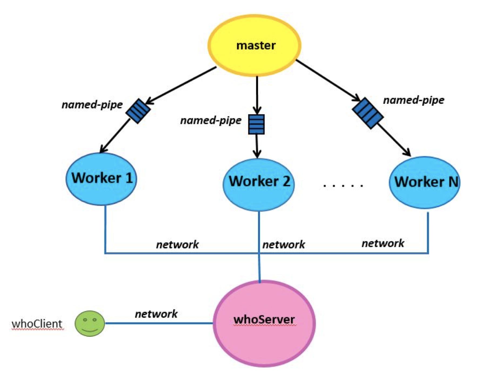

# Client-Server-Disease-Application

The aim of this project is to demonstrate the utility of multithreaded programming and internetworking with sockets. We implement a distributed system that will provide the same functionality as the [Disease-Aggregator-Application](https://github.com/PanPapag/Disease-Aggregator-Application). In particular, we implement the following three programs: 

1. A ```master``` program that creates a series of ```Worker``` processes.
2. A multithreaded server program ```whoServer``` which collects network summary statistics from ```Worker``` processes and queries from ```clients```
3. A multithreaded client program ```whoClient``` which creates many threads, where each thread plays the role of a client sending queries to ```whoServer```.



## Master 

The program will be called ```master``` and will be used as follows:

```./master –w numWorkers -b bufferSize –s serverIP –p serverPort -i input_dir```

where:

* The ```numWorkers``` parameter is the number of Worker processes that the application will generate.
* The ```bufferSize``` parameter is the size of the buffer for reading over the pipes.
* The ```serverIP``` parameter is the IP address of the whoServer to which the Worker processes will connect to
send him the summary statistics.
* The ```serverPort``` parameter is the port number where the whoServer listens.
* The ```input_dir``` parameter is a directory that contains subdirectories with the files that Workers process. Similar to [Disease-Aggregator-Application](https://github.com/PanPapag/Disease-Aggregator-Application), each subdirectory has a country name and contains files with names that are all DD-MM-YYYY format.

In the begining, the ```master``` program starts ```numWorkers``` Workers child processes and distribute the subdirectories evenly with the countries inside ```input_dir``` to Workers. Specifically, it starts the Workers and informs each one of them via named pipe about the subdirectories that the they will undertake. The parent processes also sends via named pipe the ```IP address``` and the ```port number``` of ```whoServer```. When the creation of the Worker processes is finished, the parent process remains alive to fork a new Worker process in case an existing one suddenly terminates.

Each Worker process, for each directory assigned to it, reads all its files in chronological order based on the file names and creates a series of data structures that it will use to answer questions that will be forwarded to it by whoServer. Then, it connects to whoServer and sends the following information:
1. A port number where the Worker process listens the questions that will will be forwarded to it by whoServer.
2. The summary statistics (same as [Disease-Aggregator-Application](https://github.com/PanPapag/Disease-Aggregator-Application)).

When the Worker process finishes transmitting information to whoServer, it will listen to the port number it has selected and wait for connections from whoServer for requests to the countries it manages. The signal handling remains the same as [Disease-Aggregator-Application](https://github.com/PanPapag/Disease-Aggregator-Application).

## whoServer

The program ```whoServer``` will be used as follows:

```./whoServer –q queryPortNum -s statisticsPortNum –w numThreads –b bufferSize```

where:

* The ```queryPortNum``` parameter is a port number where the whoServer will listen for connections with queries from the whoClient.
* The ```statisticsPortNum``` parameter is a port number where the whoServer will listen for connections with summary statistics from worker processes.
* The ```numThreads``` parameter is the number of threads that the whoServer will create to serve incoming network connections. These threads will be created once at the start when the whoServer starts.
* The ```bufferSize``` parameter is the size of a circular buffer that will be shared among the threads created by the whoServer process. The bufferSize represents the number of file/socket descriptors that can be stored in it (e.g. 10 means 10 descriptors).

When the whoServer starts, the initial (main process) thread creates ```numThreads``` threads. The initial thread listens on the ```queryPortNum``` and ```statisticsPortNum``` ports, accepts connections with the accept() system call, and will place the file/socket descriptors corresponding to the connections in a circular buffer of size specified by ```bufferSize```. The initial thread does not read from the connections it accepts. It simply places the file descriptor returned by accept() in the buffer and continues to accept further connections whenever it receives a connection. The job of the ```numThreads``` threads is to serve the connections whose corresponding file descriptors have been placed in the buffer. Each of the ```numThreads``` threads wakes up when there is at least one descriptor in the buffer.

Specifically, the initial thread listens on the ```statisticsPortNum``` for connections from worker processes to receive summary statistics and the port number where each worker process is listening, and listens on the ```queryPortNum``` for connections from the whoClient to receive queries about outbreaks recorded in the distributed processing system.

The whoServer accepts and serves the following requests that come from the whoClient:

* ```/diseaseFrequency virusName date1 date2 [country]```

  If the ```country``` argument is not given, the application will print the number of cases of the disease ```virusName``` recorded in the system within the period ```[date1...date2]```. If the ```country``` argument is given, the application will print the number of cases of the disease ```virusName``` in the ```country``` recorded within the period ```[date1...date2]```. The ```date1``` and ```date2``` arguments will have the format DD-MM-YYYY.
  
* ```/topk-AgeRanges k country disease date1 date2```

  The application will print the top k age categories for the ```country``` and ```disease``` that have reported cases of the specific disease in the specific country and the percentage of cases for them. The ```date1``` and ```date2``` arguments will be in the form DD-MM-YYYY. 
  
* ```/searchPatientRecord recordID```

    The parent process sends the request to all Workers through named pipes and waits for a response from the Worker with the record recordID. When it receives it, it prints it.

* ```/numPatientAdmissions disease date1 date2 [country]```

  If a ```country``` argument is given, the application will print, on a new line, the total number of patients with the ```disease``` who entered the hospital in that country within the period ```[date1 date2]```. If no ```country``` argument is given, the application will print, for each country, the number of patients with the ```disease``` who entered the hospital in the period ```[date1 date2]```. The ```date1 date2``` arguments will be in the DD-MM-YYYY format.

 * ```/numPatientDischarges disease date1 date2 [country]```

    If the ```country``` argument is given, the application will print, on a new line, the total number of patients with the ```disease``` who have left the hospital in that country within the period ```[date1 date2]```. If no ```country``` argument is given, the application will print, for each country, the number of patients with the ```disease``` who have left the hospital in the period ```[date1 date2]```. The ```date1 date2``` arguments will be in the DD-MM-YYYY format.
    
When the whoServer receives a query, it forwards it to the relevant worker processes via a socket and waits for the response from the workers. The query forwarded to a worker process, along with the responses received by the whoServer from that worker, are printed to stdout. The whoServer also forwards the response to the corresponding thread of the whoClient that made the query.

## whoClient

The whoClient program will be used as follows:

```./whoClient –q queryFile -w numThreads –sp servPort –sip servIP```

- The ```queryFile``` parameter is the file that contains the queries that need to be sent to the whoServer.
- The ```numThreads``` parameter is the number of threads that the whoClient will create to send queries to the whoServer.
- The ```servPort``` parameter is the port number where the whoServer is listening, to which the whoClient will connect.
- The ```servIP``` parameter is the IP address of the whoServer to which the whoClient will connect.

The operation of the multithreaded whoClient is as follows. It will start and open the queryFile file, which it will read line by line. Each line will contain a command that the whoServer can accept. For each command, a thread will be created that will be responsible for sending a command (i.e., one line) to the whoServer. The thread will be created but will not immediately connect to the whoServer. When all threads are created, i.e. we have a thread for each command in the file, then the threads should all start together and try to connect to the whoServer and send their command. When the command is sent, each thread will print the response it received from the whoServer to stdout and may terminate. When all threads have finished, the whoClient will terminate as well.

## Compilation and Run
Type ```make```.

The executable will be under the folder ```build```.

## License

This project is licensed under the MIT License.
